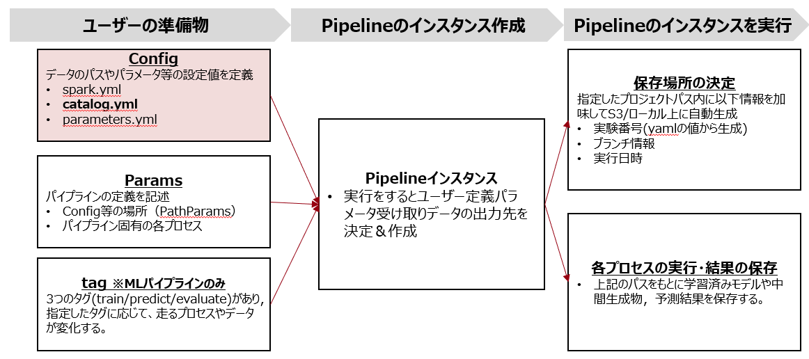

# 本ページの立ち位置
このページでは，ユーザーの準備物として必要なConfigのデータカタログ(catalog.yaml)について記載する。


# データカタログとは
## 概要
データカタログとはARISE-PIPELINEを用いて実装する際に利用するデータ情報をまとめたものを指す。
実態としては`catalog.yaml`というファイルにこの情報をまとめる。
この考え方自体はKedroというOSSで採用されたものである。ARISE-PIPELINEはKedroをバックエンドとして採用しているためこの方法に則ってデータ情報を管理している。

## catalog.yamlの記載方法
catalog.yamlにはマートパイプライン/MLパイプラインのインプットデータについて記載する。具体的には下記の情報をまとめる。

| 項目 | 詳細 | 
|-----|-----|
| type | データの型。基本的にSparkDataSetを利用することになるので下記サンプルの値でよい。 |
| filepath | データのパス。ローカル・S3いずれも可でファイル名も含む。 |
| file_format |データの拡張子 |
|load_args|データを読み込むときの細かな挙動を指定。|
|save_args|データの保存時の挙動を指定。|

書き方のサンプル(hoge_dataというデータを利用する場合)
```yaml
hoge_data:
    type:arise_pipeline.datasets.spark.SparkDataSet
    filepath: data/hoge_data.parquet
    file_format: parquet
    load_args: 
        header: True
        inferSchema: True
    save_args:
        sep: ',' 
        header: True
```
