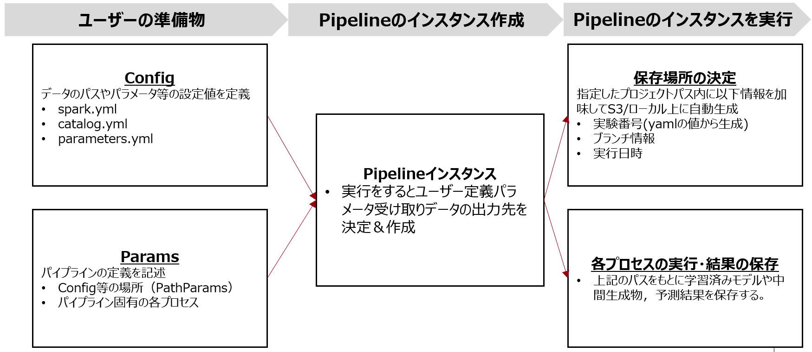

# マートパイプラインの基本説明

## 3つのレイヤーとワークフロー
### 全体感
以下がマートパイプラインの全体構成図となっている。ユーザーはConfig，Paramsの2つを準備する。

マートパイプラインには以下の三つのレイヤーが存在し，それらを組み合わせ加工結果をマートとして保存する。なお，raw層やintermediate層などのレイヤーに関しては[LayeredThinking](#layered-thinking)
および[分析プロセスのレイヤーとルール](#分析プロセスのレイヤーとルール)を参照。これら三つのレイヤーは`MartPipeline`クラスの引数として表現されており，それぞれ`MartPipelineParams`クラスを渡す必要がある。
| レイヤー名 | 立ち位置 | 役割|
| ---- | ---- |---- |
| raw2inter | 源泉データのコピー対する型付け・クレンジングを実施 | raw層のデータをを加工し，intermediate層へ設置 |
| inter2primary | 他の分析PJでも引用・加工することができるテーブルを作成 |intermediate層のデータを加工し，Primary層へ設置。 |
| primary2primary | 他の分析PJでも引用・加工することができるテーブルを作成 |Primary層のデータを加工し，Primary層へ設置。 |

## Params
### MartPipelineParams
マートパイプラインのレイヤーは`MartPipelineParams`クラスを用いて定義する。
利用するときは下記の引数が全て必要となる。
| 引数名 | 型 | 詳細|
| ---- | ---- |---- |
| `input_names` | `List[str]`|入力のテーブル名のリスト |
| `output_names` | `str`|出力のテーブル名|
| `function` | `Callable`|input_namesのデータを受け取り，output_namesとして出力を生成する関数。 |
| `save` | `bool`|出力を保存するか否か。デフォルトはTrue。

下記はraw2interに渡すパラメータ`raw2inter_params`を宣言したときの例となる。
```python
# raw2interで処理をする関数
def raw2iner_function(sdf):
    sdf_raw2inter_output = sdf *2 #実利用時はレイヤールールに則って該当する処理を記述。
    return sdf_raw2inter_output

# raw2interに渡すParams
raw2inter_params = MartPipelineParams(
  input_names= ['sdf_raw']
  output_name= 'sdf_raw2inter_output'
  function= raw2iner_function
  save=True)
```
inter2primaryやprimary2primaryを利用するときも上記と同じ流れで実装する。

### PathParams
マートパイプラインで利用するConfigファイルやアウトプットを設置するパスまわりを管理するParamsがMartPathParamsである。
※MLパイプラインにはMlPathParamsがあるが現時点では中身は全く同じ。
| 引数名 | 必須か否か|型 | 詳細|
| ---- | ---- |---- |---- |
| `output_root_path` | 必須|`Path`| 出力のルートを定義 |
| `output_subdir_order` | 必須|`Path`|ルートパスの下層(各実験のアウトプットパス)の規則を定義|
| `project_path` | 任意|`Path`|プロジェクトのルートパス。ここがベースで下記のパス達はこれの配下にある。任意ではあるがデータカタログで相対パスでfilepathを指定するときは必要。|
| `conf_path` | 任意|`Path`|yml(parametes, catalog, spark, mlflow etc)を格納しているディレクトリ名.|
| `parameters_yaml_path` | 任意|`Path`|conf配下のパラメータファイルを個別で指定したいときに利用|
| `catalog_yaml_path` | 任意|`Path`|conf配下のカタログファイルを個別で指定したいときに利用 |
| `spark_yaml_path` | 任意|`Path`|conf配下のsparkファイルを個別で指定したいときに利用 |

## インスタンス作成/実行
`MartPipeline`クラスに対して上記のParams達を引数として渡してインスタンスして宣言できる。

| 引数名 | 必須か否か|型 | 詳細|
| ---- | ---- |---- |---- |
| `path_params` | 必須|`PathParams`| 出力のルートを定義 |
| `raw2inter` | 任意|`List[MartPipelineParams]`|raw2interに属するMartPipelineParamsのリスト|
| `inter2primary` | 任意|`List[MartPipelineParams]`|inter2primaryに属するMartPipelineParamsのリスト|
| `primary2primary` | 任意|`List[MartPipelineParams]`|primary2primaryに属するMartPipelineParamsのリスト|

下記がサンプルコード
```python
#マートパイプラインのインスタンス宣言
mart_pipeline=MartPipeline(
  path_params= mart_pathparam
  raw2inter= raw2inter_params,
  inter2primary =inter2primary_params,
  primary2primary = primary2primary_params
)
```
`raw2inter`，`inter2primary`，`primary2primary`はいずれも任意であるため自身が作成したいテーブルの特性・加工内容に応じて選択する。
複数利用したい場合は，Paramsのリストを渡せばよい。
インスタンスを宣言した後，`make()`コマンドと`run()`コマンドを下記のように用いることでインスタンスの作成・実行を行うことができる。
```python
mart_pipeline.make() #マートパイプラインインスタンスのビルド
mart_pipeline.run() #マートパイプライン実行
```
## 成果物の保存/バックアップに関して
`run`コマンドの実行後，`PathParams`に渡した`output_root_path`の配下に，下記の情報を加味してパスが自動で生成される。
- コマンドの実行日時
- ブランチの情報
- 実験番号(Configのyamlファイルの値から生成される)
パスの全体構造は下記の通り。
```
├── project_name
    ├── branch_name
        ├──experiment_id
            ├──01_raw
            ├──02_intermediate
            ├──03_primary
            ├──04_feature
            ├──05_model_input
            ├──06_models
            ├──07_model_output
            └──08_reporting
```
途中でエラーなく実行できれば，各種Paramsの引数`save=True`としたものに関して，ParhParamsで指定したディレクトリに結果が保存される。

## 参考リンク
本ページ上部の[全体感](#全体感)で記載していたリンク集を記載。URLとタイトルを閲覧したい方はググっていただけると。
### Layered Thinking
- ページタイトル： The importance of layered thinking in data engineering
- 媒体：towardsdatascience
- URL：https://towardsdatascience.com/the-importance-of-layered-thinking-in-data-engineering-a09f685edc71
### 分析プロセスのレイヤーとルール
- ページタイトル：分析プロセスのレイヤーとルール
- 媒体：ARISEのConfluence
- URL：https://ariseanalytics.atlassian.net/wiki/spaces/CADMAULTVWG/pages/2903474412#%E3%83%AB%E3%83%BC%E3%83%AB%E8%A1%A8