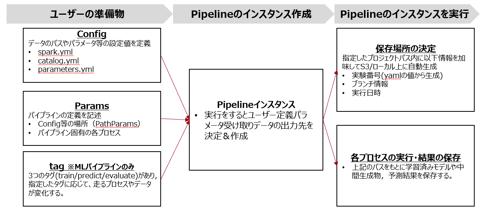

# MLパイプラインの基本説明
本ページではARISE-PIPELINEモジュールにあるMLパイプラインの基本的な内容に関して説明する。
## 全体感

以下がMLパイプラインの全体構成図となっている。



## ユーザー準備
### Config
設定値を管理するyamlファイルを準備。各yamlファイルの詳細については個別のページを参照。


### Params
#### 概要
MLパイプラインには個別の役割を持つ6つのParamsが存在する。これらを組み合わせることで前処理-学習-予測-評価をワンストップで実行可能。
Params名とそれぞれの役割は以下表のとおり。

| Params名 | 役割 | 必要な実装 |
| ---- | ---- |  ---- |
| TargetUserPipelineParams | データの縦幅を決定 |入力データ名<br>出力データ名<br>縦幅フィルターfunction
| FeaturePipelineParams | 特徴量データの前処理 |入力データ名<br>出力データ名<br>ジョインキーの指定<br>特徴量の前処理function
| LabelPipelineParams | ラベルデータの前処理 |入力データ名<br>出力データ名<br>ジョインキーの指定<br>ラベルの前処理function
| JoinPipelineParams | 縦幅・特徴量・ラベルの結合 |特になし
| ModelPipelineParams | モデルの学習・予測 |データの分割方法<br>追加の前処理<br>モデル<br>チューニング内容
| PostPipelineParams | 評価・一定形式のデータ整形 |評価方法<br>後処理<br>可視化方法

また，上記に加えてPathParamsがある。

#### 注意点
各Paramsではユーザー定義functionを受け付ける仕様になっているが，functionの引数の種類として下記の3種類が存在する。

| 引数種別 | 役割 |
| ---- | ---- |  
| 必須引数 | 各functionで必ず定義する必要のある引数。<br>三つの引数のなかでは先頭に記載する必要があり，順番も守ること。
| パラメータ引数 | parameters.yamlに記述した値を参照する際に用いる引数。<br>関数側でパラメータ名と同じ引数を定義すると，その値を引数として利用可能。必須引数より後ろで定義する。
| 特殊引数 | パイプラインのプロセス側でもっている固有の値を持つ引数。functionによって使えるものが変わる。<br>必須引数より後ろで定義する。

下記の引数名は特殊引数に該当する。
| 引数名 | 型 | 詳細| 利用可能なパイプライン|
|-----|-----|-----|-----|
| `data_type` | str| 関数に入力するデータの種類。値はtrain/val/testのいずれか。|TargetUserPipeline<br>FeaturePipeline<br>LabelPipeline<br>PostPipeline|
| `output_path` | str |パイプラインの出力を保存するディレクトリパス。各関数の出力先として適切なレイヤーに対応する**サブディレクトリの絶対パスを記載する。**※アウトプットパスのルートではない|raw2inter<br>inter2primary<br>primary2primary<br>PostPipeline|

#### PathParamsParams
MLパイプラインで利用するConfigファイルやアウトプットを設置するパスまわりを管理するParamsが`MlPathParams`である。
※マートパイプラインには`MartPathParams`があるが現時点では中身は全く同じ。

- マストな引数
  - `output_root_path`：出力のルートを定義
  - `output_subdir_order`：ルートパスの下層(各実験のアウトプットパス)の規則を定義
- optionalな引数
  - `project_path`：プロジェクトのルートパス。ここがベースで下記のパス達はこれの配下にある。任意ではあるがデータカタログで相対パスでfilepathを指定するときは必要。
  - `conf_path`：yml(parametes, catalog, spark, mlflow etc)を格納しているディレクトリ名.
  - `parameters_yaml_path`：conf配下のパラメータファイルを個別で指定したいときに利用
  - `catalog_yaml_path`：conf配下のカタログファイルを個別で指定したいときに利用
  - `spark_yaml_path`：conf配下のsparkファイルを個別で指定したいときに利用
#### TargetUserPipelineParams
- データの縦幅を決定(filter)するプロセス。catalog.ymlに記載されたデータをもとに，trainとtestの縦幅を決める
- `TargetUserPipelineParams`を利用してParamsを定義する。必要な引数は下記の通り。
  - `input_names`: 入力テーブル名(str)のリスト
  - `output_name` :出力テーブル名(str).
  - `sdf_func` : 定義済みの縦幅フィルター関数。
    - 使える特殊引数は`data_type`. これを利用するこで共通の関数でtrain/testに対する異なる処理を実施できる。

以下が`TargetUserPipelineParams`の記述例
```
#まず縦幅フィルターを行う関数を定義
def filter_func(
    input_sdf: sdf,
    target_data_value_type: dict[Literal["train", "test"], str],
    data_type: Literal["train","test]:
): -> sdf
    target_sdf = #処理内容を記載。

    return target_sdf

# TargetUserPipelineParamsの定義。
target_user_pipeline_params = TargetUserPipelineParams(
    input_names = ["input_table_name"],
    output_name = "output_table_name"
    sdf_func = filter_func

)

```

#### FeaturePipelineParams
- 特徴量データの前処理を行うプロセス。1つのデータソースに対して1つの前処理を対応付けて、各データソースに対してそれぞれ処理を記載する。そのため，生成したい特徴量データの数だけParamsを用意する。
- **Estimatorのような処理(trainデータのみにfitさせてvalデータやtestデータにはtransformさせるもの)については非該当。**ModelPipelineのPreprocessで記載する。
  - ここで記載するとtestデータを含めてfitすることとなり，リークとなってしまう。
- 

#### LabelPipelineParams
- ラベルデータの前処理を行うプロセス
- 1つのデータソースに対して1つの前処理を対応付けるが、複数データソースは想定していない


#### JoinPipelineParams
- 各前処理済みのデータをマージするプロセス
- ジョイン処理自体は実装する必要がなく、各データのマージキーのみ渡せばよい.

#### ModelPipeline
- モデルの学習や予測を行うプロセス.
- マージ済みのデータに対する追加の前処理やtrain/val分割なども実施.

#### PostProcessPipeline
- 評価、一定形式へのデータ整形などの後処理を行うプロセス.


Config
#### ModelPipelineParams

#### PostPipelineParams


### Tag
#### 概要
「train」「predict」「evaluate」の3つがあり，指定したタグに応じて利用データと走るプロセスが変わる。
そのため実行コマンドを叩く際に与えるタグを変えるだけで学習/予測/評価の切り替えが可能でそれぞれ個別にコードを書く必要がない。
TagとParamsの関係性は以下の通り。なお，Tagの指定は単一でも複数でも可能。
| Params名 | 役割 | train | predict| evaluate |
| ---- | ---- |  ---- | ---- |  ---- |
| TargetUserPipelineParams | データの縦幅を決定 |○|○| -|
| FeaturePipelineParams | 特徴量データの前処理 |○|○| -|
| LabelPipelineParams | ラベルデータの前処理 |○|○| -|
| JoinPipelineParams | 縦幅・特徴量・ラベルの結合 |○|○| -|
| ModelPipelineParams | モデルの学習・予測 |○|○| -|
| PostPipelineParams | 評価・一定形式のデータ整形 |○|○| ○|

#### データとの対応関係
タグとデータの対応関係は下記のとおり。それぞれのタグに応じて扱われるデータやラベルが必要か否か変動する。
|      |trainデータ | valデータ| testデータ |
| ---- | ---- |  ---- | ---- | 
|利用タグ |train | train| predict/evaluate |
|用途 | モデルの学習| early stopping<br>ハイパラチューニング<br>スタッキング時のoof値算出 |本番運用時の予測値算出<br>精度算出
|ラベルの要・不要 |必要 |必要 |なくても可|

## インスタンス作成/実行
`MlPipeline`クラスに対して上記のParams達を引数として渡してインスタンスとして宣言できる。

- 必須の引数
  - path_params: MlPathParams
  - target_user_pipeline_params:
  - feature_pipeline_params_all:
  - label_pipeline_params:
  - model_pipeline_params:
  - post_piepline_params:


'''
ml_pipeline = MlPipeline(
    path_params = path_params,
    target_user_pipeline_params=target_user_pipeline_params
    feature_pipeline_params_all=feature_pipeline_params_all
    label_pipeline_params=label_pipeline_params
    model_pipeline_params=model_pipeline_params
    post_piepline_params=post_piepline_params
)

'''

インスタンスを宣言した後，`make()`コマンドと`run()`コマンドを下記のように用いることでインスタンスの作成・実行を行うことができる。
```
ml_pipeline.make(tags=["train","predict","evaluate"]) #MLパイプラインインスタンスのビルド
ml_pipeline.run() #MLパイプライン実行
```
`run()`コマンドを実行しエラーがなければ，ParhParamsで指定したディレクトリに結果が保存される。