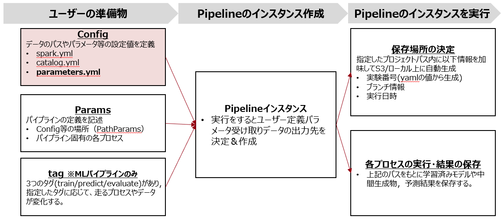

# 本ページの立ち位置
このページでは，ユーザーの準備物として必要なConfigのパラメータ(parameters.yaml)について記載する。

# パラメータ
## 概要
- ARISE-PIPELINEでは学習等で用いるパラメータを`parameters.yaml`というファイルに記載する。
- 各Paramsに渡す関数内で利用するパラメータの値のハードコードを防ぎ、yamlファイルで一括管理するのが目的。
- 記載したパラメータを利用するには各Paramsに渡すfunctionの引数名にparameters.yaml記載のパラメータ名と同じ名前のものを指定したら利用できる。以降に実際の記述例も書いているのでそちらを参照。

## parameters.yamlの記載方法
- ここは一般的なyamlファイルに値を書くように記載する。
- 一部特殊引数として指定してあるキーがあり，そちらを除けばキーの値は自由。特殊引数に関してはこちら(特殊引数のリンク)を参照。
``` 
# 以下はparameters.ymlの記載例。
train_ratio: 0.8 # train/valの比
labelCol: target # 目的変数の列名
featuresCols: # 特徴量の列名
  - col_name_1
  - col_name_2
  - col_name_3  
```

以下に指定したSparkDataFrameからfeaturesColsに記載した列名を抽出する関数を利用する場合の例を記述する。
```python
# your_notebook.ipynb に記載
def sample_function(input_sdf, featuresCols): # featuresColsはparameters.ymlに記載。
    selected_sdf = input_sdf.select(featuresCols)
    return selected_sdf

raw2inter_params = MartPipelineParams(
  input_names= 'input_table'
  output_names= 'output_table'
  function= sample_function
  save=True)
```


