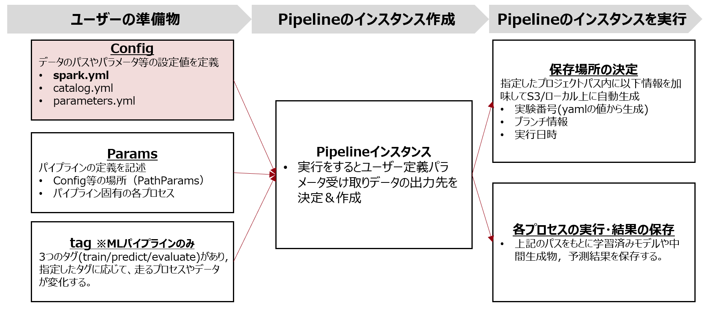

# 本ページの立ち位置
このページでは，ユーザーの準備物のConfigファイル(spark.yaml/mlflow.yaml )にtついて記載する。
なおこのページで紹介するファイルは任意ファイルであり，ARISE-PIPELINEの動作に必須のものではない。

# Spark.yaml
## 概要
- Configファイルの一つでSparkの設定値を管理する。
- RAIZIN-wiki記載のデフォルト値はARISE-PIPELINEモジュール内で反映されているので，そちらを利用する場合は下記の「必須」項目をyamlに記載するだけでよい。
  - 自身の分析スクリプトにSparkSessionを起動させるコードを書く必要もない。
- `additional_spark_conf`は任意の値でデフォルト値とは異なる値を利用する場合，ここにKeyとValueを記載する。
- 
| 項目 | 詳細 | 必須/任意
|-----|-----|-----|
| unit_name | ユニット名 | 必須|
| team_name | チーム名 |必須|
| executor_size |エグゼキューターサイズ。S/M/Lのいずれか|必須|
|additional_spark_conf|デフォルト設定値を上書きしたい項目。|任意|

## 記載例
以下はSynapseML0.10.1を利用するために必要な設定値をSparkConfに反映させるための記述例。
```
unit_name: hoge
team_name: fuga
executor_size: S #S/M/Lのいずれか
additional_spark_conf:
    spark.jars.packages: com.microsoft.azure:synapseml_2.12.:0.10.1
```
# MLFlow.yaml
## 概要
- このファイルはMLFlowをARISE-PIPELINEで利用する場合に使用。
- 他のyamlファイルのようにMLFlowに関連する設定値を記載する。


- tracking_uri
  - MLFlowサーバーのアドレス。このURIを設定すると実験の結果を追跡しMLFlowに記録する場所を指定できる。アドレスはチームごとに割り振られているので該当するアドレスを記載する。
- experiment_args 
  -**必須**。 `mlflow.create_experiment`に渡される引数。`name`,`artifact_location`,`tags`の三つを渡すことができるが必須なのは`name`のみ。 
- run_args
  - 任意。`mlflow.start_run`に渡される引数. 基本的にrun_nameとtagsを指定してあげればよい。
- log_parameters
  - 任意。MLflowにおける`parameters`としてログを行う対象を記載.それぞれの項目についてはboolで指定する。ログの対象としては24年4月時点で以下
    - parameters: parameters.yamlに記載してあるパラメータ。全選択もしくは部分的な選択どちらでもOK。
    - experiment_path: ARISE-PIPELINEが発行するexperiment_path
- log_tags
  - 任意。MLflowにおける`tags`としてログを行う対象を記載、ログの対象としては24年4月時点で以下。
    - make_tags: `make`コマンドに用いたtrain/predict/evaluateのタグ
- log_metrics
  - 任意。`mlflow.log_metric`でログを行う対象を記載、ログの対象としては24年4月時点で以下。
    - scores: PostProcess `PostPipeline`における`eval_func`の吐き出すスコア.train/val/testそれぞれに対して個別指定も可能。
    - nodes_status: ノードの成功数、エラー数など

以下は記述例
```
tracking_uri: http://192.168.1.0 #自チームの利用が承諾されているURIを入力する

experiment_args:
  name: test_experiment #実験の名前。
  artifact_location:
  tags:

run_args:
  run_id: #実行時に実験付与されるUUID
  run_name:#実験の名前。run_id が指定されていない場合にのみ使用
  tags: #実行時にタグして設定するキー(文字列)と値の辞書。
    tag1:
    tag2:
  nested: False

log_parameters:
  parameters: #parametersファイル記載のものを書く。"parameters:True"と記載すると全てのパラメータについてロギング。
    seed: True
    train_ratio: True
  experiment_path: ARISE-PIPELINEが発行するexperiment_path

log_tags:
    make_tags: True
log_metrics:
  scores: #PostPipelineのeval_funcで出職するスコア。"scores: True"と書けば全てのロギングする。
    train: True
    val: False
    test: True
  nodes_status: True
```

実行後，`tracking_uri`に指定したURLにブラウザでアクセスすると上記の設定値が反映されたmlflowのWEBUIが表示される。