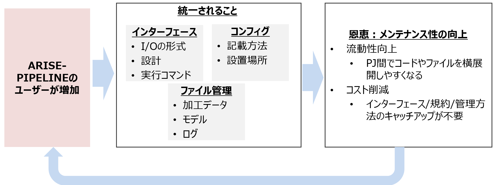
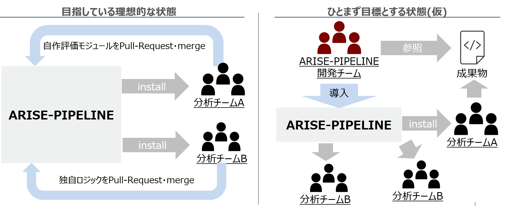
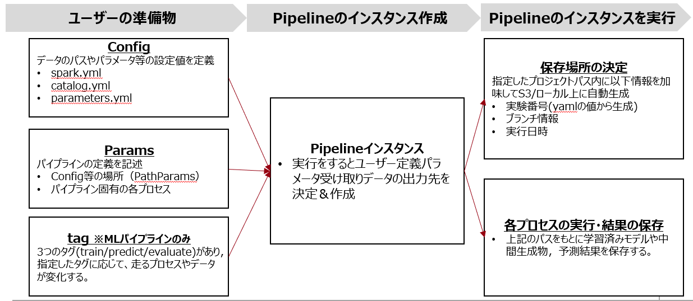

# ARISE-PIPELINEとは

## 概要
ARISE-PIPELINEとは，データ分析・機械学習モデル構築を効率よく行うために開発されたPythonフレームワークである。

## 開発の背景
ARISEでは様々な分析がプロジェクトごとにおこなわれているが，実装のコードの書き方等がプロジェクトごとに異なっていること，そのルールやノウハウがプロジェクトで閉じてしまっているという点からプロジェクトの各フェーズにおいて下記のような課題が存在。

| プロジェクトフェーズ | 課題内容 |
| ---- | ---- |
| 開発 | プロジェクト間で共通化可能な処理を都度実装することにより，無駄な工数によるコスト増加精度改善工数減に伴う間接的な品質低下<br>チームごとに設計するためインターフェース等がまばらになってしまい都度キャッチアップコスト発生。 |
| 運用 |ipynb形式でしかコードが管理されておらず、AirFlowなどを活用した自動化ができない。<br>前任者が作成したコードの実行手順や全体設計・処理ロジックが不明で引継ぎ工数の増加  |

## アプローチ
本フレームワークによって以下の処理を共通化したパイプラインを構築・普及することで課題の解決を図る.

- 典型処理や高度処理（モジュール化）
- 基盤となる分散処理フレームワークやライブラリ
- 成果物管理の統一
- コードの実行手順

## 目指すべき姿
上記の課題を解消し，本フレームワークを社内で広げていくことで下記２つの世界を目指す。

### コードのインターフェース・管理方法を標準化し不要な工数を削減
PJ横断で同一のフレームワークを利用している状態とすることでコードのインターフェースやコンフィグの管理方法等を標準化する。PJごとに異なっている現状を是正し，メンテナンス性の向上やキャッチアップコストを削減。


### ARISE-PIPELINEをハブにしたノウハウサイロ化の解消
OSSライクに他チーム成果物を取り込める仕組みを開発し成果物を吸収・再配布することで案件で得た知見を広げ資産のサイロ化を防ぐ。
※V1時点では仕組を検討中。


## ARISE-PIPELINEの構成要素
ARISE-PIPELINEモジュールには「マートパイプライン」と「MLパイプライン」の2つのパイプラインで構成されている。
それぞれの役割は下の表のとおり。

| 分析ステップ | パイプライン |
| ---- | ---- |
| 要件定義 | (非対象) |
| データ収集 | マートパイプライン |
| マート作成 | マートパイプライン |
| モデル用前処理 | MLパイプライン |
| モデリング | MLパイプライン |
| 結果収集 | MLパイプライン |
| 報告 | (非対象) |
| 納品 | (非対象) |

## 全体構成
ユーザーは「Config」「Params」「tag(MLパイプラインのみ)」を用意してパイプラインのインスタンスを作成することでパイプラインの実行が可能となる。実行すると保存先を自動生成し，各種データを保存する。
 

# Layered Thinkingとは
## 概要
[Layered Thinking](https://towardsdatascience.com/the-importance-of-layered-thinking-in-data-engineering-a09f685edc7 "The importance of layered thinking in data engineering")
とは，ARISE-PIPELINEのベースになっているKedroが開発したQuantum Blackが提唱したデータ分析プロセスを構造化した考え方である。データを取得してから結果を得るまでの各工程にて行う処理を定義している。これにより分析のガバナンスを持たせることが目的となっている。
```
├── 01_raw            <-- Raw immutable data
├── 02_intermediate   <-- Typed data
├── 03_primary        <-- Domain model data
├── 04_feature        <-- Model features
├── 05_model_input    <-- Often called 'master tables'
├── 06_models         <-- Serialised models
├── 07_model_output   <-- Data generated by model runs
├── 08_reporting      <-- Ad hoc descriptive cuts
```

## ARISE-PIPELINEとの関係
ARISE-PIPELINEでも上記の考え方に則って2つのパイプラインを構築した。各レイヤーとパイプラインの対応表は下記。

| レイヤー名     | パイプライン名    |
|:-----------    |:------------    |
| 01_raw         |マートパイプライン |
| 02_intermediate|マートパイプライン |
| 03_primary     |マートパイプライン |
| 04_feature     |MLパイプライン    |
| 05_model_input |MLパイプライン    |
| 06_models      |MLパイプライン    |
| 07_model_output|MLパイプライン    |
| 08_reporting   |MLパイプライン    |

各レイヤーで行うべき処理等については[こちら](https://ariseanalytics.atlassian.net/wiki/spaces/CADMAULTVWG/pages/2903474412
"The importance of layered thinking in data engineering")のページに記載している。ARISE-PIPELINEを用いて実装を行う際にはこちらのルールにレイヤーごとに行うべき処理を把握し，その内容を実装すること。

